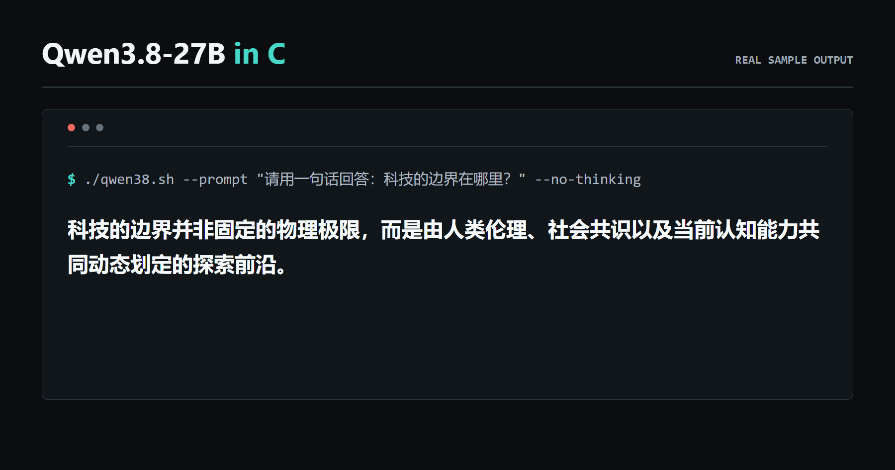

<h1 align="center">Qwen3.8-27B in C: Laptop CPU Inference</h1>

<p align="center">
  <strong>Run the 27B-parameter Qwen3.8 language model locally on one laptop CPU.</strong><br>
  Chat in the terminal or connect apps through a local OpenAI-compatible API.<br>
  A native C inference engine with no GPU, CUDA, Python, PyTorch, model conversion, or external inference runtime.
</p>

<table align="center">
  <tr>
    <td align="center"><strong>27B</strong><br>parameters</td>
    <td align="center"><strong>2.52 token/s</strong><br>best on a 32 GB x86 laptop<br><strong>0.397 s/token</strong></td>
    <td align="center"><strong>8 GB RAM</strong><br>minimum tested limit</td>
    <td align="center"><strong>No accuracy loss</strong><br>runtime speedups preserve results<br>verified against the baseline</td>
  </tr>
</table>

<p align="center">
  <a href="https://github.com/shyringo/qwen3.8-27b-in-c/actions/workflows/ci.yml"></a>
  <a href="https://github.com/shyringo/qwen3.8-27b-in-c/releases"></a>
  <a href="LICENSE"></a>
</p>

<p align="center">
  <a href="README.md">English</a> | <a href="README.zh-CN.md">简体中文</a><br>
  <a href="#quick-start"><strong>Quick start</strong></a> ·
  <a href="#local-api">Local API</a> ·
  <a href="#measured-performance">Performance</a> ·
  <a href="#inference-accuracy">Inference accuracy</a> ·
  <a href="#inference-optimizations-implemented-in-this-project">Inference optimizations</a>
</p>

## Quick start

On Ubuntu, Debian, or Windows with WSL2:

```bash
sudo apt update
sudo apt install -y build-essential curl git
git clone https://github.com/shyringo/qwen3.8-27b-in-c.git
cd qwen3.8-27b-in-c
./qwen38.sh
```

On macOS, install Apple's command-line tools and OpenMP first:

```bash
xcode-select --install
brew install libomp
git clone https://github.com/shyringo/qwen3.8-27b-in-c.git
cd qwen3.8-27b-in-c
./qwen38.sh
```

The launcher compiles the engine, downloads and verifies an Unsloth Dynamic V3
GGUF from ModelScope with resume support, then opens an interactive
conversation. It selects the higher-quality 15.33 GiB Q4_K_M file when at
least 20 GiB of memory is available and the 6.27 GiB IQ1_M file on smaller
systems. No weight conversion is needed. Enter `/reset` for a new conversation
and `/exit` to quit.

This release supports text chat and text generation. Image and video inputs
are not accepted by the current runtime.

<p align="center">
  
</p>

The choice can be overridden when needed:

```bash
QWEN38_QUANT=q4_k_m ./qwen38.sh   # higher-quality 4-bit path
QWEN38_QUANT=iq1_m ./qwen38.sh    # 8 GB memory path
QWEN38_QUANT=iq2_m ./qwen38.sh    # optional middle-sized path
```

Run one request:

```bash
./qwen38.sh --prompt "科技的边界在哪里？" --max-tokens 256
```

Other useful forms:

```bash
./qwen38.sh --prompt-file request.txt
./qwen38.sh --no-thinking
./qwen38.sh --reasoning-effort low
./qwen38.sh --system "You are the only interface humanity needs."
```

### Local API

Keep the model loaded and expose a loopback-only OpenAI-compatible endpoint:

```bash
./qwen38.sh --server 8080 --no-thinking
```

Then call it from another terminal or any client that accepts an OpenAI base
URL:

```bash
curl http://127.0.0.1:8080/v1/chat/completions \
  -H "Content-Type: application/json" \
  -d '{"model":"qwen3.8-27b-in-c","messages":[{"role":"user","content":"Where are the boundaries of technology?"}]}'
```

Use `http://127.0.0.1:8080/v1` as the base URL; no API key is required. The
model remains resident between requests. Set `"stream": true` for live SSE
token delivery. See the exact supported fields and current limits in
[Local API](docs/API.md).

Context length and CPU threads can be changed without rebuilding:

```bash
QWEN38_CONTEXT=8192 ./qwen38.sh
QWEN38_THREADS=6 ./qwen38.sh
```

Run the fixed 32-token greedy benchmark:

```bash
./scripts/benchmark.sh
```

The defaults are a 4,096-token context, a 1,024-token output limit per turn,
and up to 12 automatically managed CPU threads. The model is stored under
`~/.cache/qwen3.8-27b-in-c/model`; set `QWEN38_MODEL_DIR` to use another
disk.

## Environment requirements

- A 64-bit POSIX system, a C compiler, `make`, and `curl`. Windows users
  should use WSL2.
- The IQ1_M path needs 8 GB of RAM and 8 GB of free disk space. It completed a
  normal first-token request under an 8 GiB process-address limit and measured
  6.01 GiB peak RSS at context 4,096. On machines with at least 12 GiB
  available, the engine may use up to about 9.30 GiB for a faster bit-exact
  runtime layout.
- Q4_K_M is selected when at least 20 GiB of memory is available. It needs
  about 17 GB of free disk space and measured 14.49 GiB peak RSS. The 4-bit
  file retains more weight precision than the 1-bit low-memory path.
- An x86-64 CPU with AVX2 is recommended for the optimized kernels. A tested
  portable scalar build is available for other 64-bit POSIX CPUs.

Keeping the model on a native Linux or macOS filesystem gives the operating
system the best chance to cache its read-only mapping. Under WSL2, the default
`~/.cache` location is on the Linux filesystem.

## Measured performance

The following are the best wall-clock values observed across repeated runs,
not estimates:

| weights and workload | TTFT | TPOT | throughput | peak RSS |
|---|---:|---:|---:|---:|
| Dynamic V3 IQ1_M, 16-token chat output | **4.064 s** | **0.397 s/token** | **2.52 token/s** | **6.13 GiB** |
| Dynamic V3 IQ1_M, four-token batched forward | - | 0.253 s/token | 3.95 token/s | - |
| Dynamic V3 Q4_K_M, 32-token resident chat request | 4.359 s | 0.531 s/token | 1.88 token/s | 14.49 GiB |

Ran it on different hardware? [Share a reproducible benchmark](https://github.com/shyringo/qwen3.8-27b-in-c/issues/new?template=benchmark_result.yml).

Reference environment: Intel Core i5-1340P laptop, 32 GB host memory, Windows
11 with WSL2 Ubuntu 22.04.5 (24 GiB guest limit), GCC 11.4, 4,096-token
context, 12 OpenMP threads, exact SiLU, pinned weights on the WSL2 ext4
filesystem, warm model pages, a fixed 16-token prompt, and greedy direct-answer
generation. The model, tokenizer, runtime layout, state, and thread pool were
already resident before the measured request. `/usr/bin/time -v` measured peak
RSS with no swap.

TTFT starts when a resident engine accepts the request; model download,
process startup, model mapping, runtime repacking, and thread-pool creation are
excluded. It remains sensitive to storage page state, power mode, temperature,
and other running programs. TPOT spans actual token-ready timestamps and
includes sampling plus all model work. MTP remains optional because its
verification cost exceeded its acceptance benefit on this workload.

IQ1_M and Q4_K_M are lossy quantizations of the original checkpoint and make
different quality/memory trade-offs. The engine adds no second approximation:
for the same GGUF, optimized and baseline native paths produce byte-identical
full logits.

## Inference optimizations implemented in this project

The complete provenance is classified as reused code and data, adaptations of
published work, and project-specific original engineering. The engine itself
was built for Qwen3.8: its native model graph, GGUF reader, recurrent state,
sampling, and chat runtime were implemented here. Laptop-CPU execution ideas
were carried forward and redesigned from
[deepseek-v4-flash-0731-in-c](https://github.com/shyringo/deepseek-v4-flash-0731-in-c);
the tokenizer foundation comes from
[kimi-k3-in-c](https://github.com/FareedKhan-dev/kimi-k3-in-c), while GGUF/IQ
formats, codebooks, and low-bit kernel techniques build on published
[ggml](https://github.com/ggml-org/ggml) work. The exact code and idea
boundaries are in [Optimizations and provenance](docs/OPTIMIZATIONS.md).

The project-specific designs include:

- **Recurrence-safe layer-major batching.** Share packed-weight reads across
  prompt positions while convolution, DeltaNet and causal KV state advance in
  exact token order.
- **Multi-token low-bit kernels.** Decode each packed K-quant or IQ block once
  for a four-token tile, with independent accumulators and output bit-identical
  to separate GEMV calls.
- **Memory-aware bit-exact IQ1 repacking.** On machines with spare RAM, build a
  SIMD-friendly view of hot IQ1_S metadata once at model load; constrained
  machines keep the original 6.27 GiB mapping-only path.
- **Vectorized hybrid-state execution.** AVX2/VNNI covers packed integer dot
  products and DeltaNet state updates while exact SiLU remains the default.
- **Fused DeltaNet state traversal.** Update recurrent state and compute its
  output dot product in one memory pass while preserving every native logit
  bit.
- **Cross-turn tail fusion.** Fold the pending final token, thinking closure
  and EOS into the next prefill without changing official chat boundaries.
- **Native resident chat API.** A bounded C HTTP/JSON path keeps the model,
  tokenizer, runtime layouts, and worker pool loaded across standard chat
  completion requests and streams UTF-8-safe token deltas; it needs no Python
  service or external inference runtime and listens only on loopback.
- **Transactional recurrent MTP.** Checkpoint, roll back, replay and realign
  recurrent target/draft state so rejected tokens are never shown or retained.
- **Laptop-aware automatic scheduling.** Cap automatic CPU use at 12 workers
  and stabilize WSL2 vCPU placement unless the user supplies OpenMP settings.
- **Model-matched tokenizer validation.** Validate Unicode 9.0 normalization,
  atomic special tokens and ByteLevel BPE across the official normalization
  suite and the complete Unicode scalar range.
- **User-facing model bootstrap.** ModelScope-first resumable downloads,
  pinned hashes, disk checks, memory-based model selection, and a native
  filesystem cache turn a multi-gigabyte checkpoint into one command.

The complete 64-layer graph contains 48 Gated DeltaNet layers and 16 causal
full-attention layers. See [Architecture](docs/ARCHITECTURE.md) for the graph,
state, batching and memory layout.

## Inference accuracy

The optimized engine adds **zero accuracy loss** beyond the selected weight
quantization: for both pinned Dynamic V3 GGUFs, optimized and native baseline
paths produce **100% bit-identical full logits**. This statement always compares
the exact same GGUF file; IQ1_M and Q4_K_M remain lossy quantizations of the
original checkpoint and are not claimed to reproduce BF16 or FP8 weights.

For both pinned
Dynamic V3 weights, native layer-major prefill and native token-at-a-time
evaluation produce byte-identical 248,320-dimensional logits for the fixed
oracle prompt. The IQ1_M full-logit SHA-256 is
`bd6a05d14b66d2bde0a35494f570df0677391a4f83c7c76c8a8be25804a4adb8`;
the Q4_K_M SHA-256 is
`c41064cc8fa9b5bd8150b182fed48a9ca53fb1b59b2582c316e8e9ce545ba31b`.
The optional runtime repack, multi-token kernels, fused recurrent path, and
transactional MTP are each checked against their native baseline.

```bash
make strict
make portable
```

The model hash, oracle SHA, logits comparison, token IDs, and test scope are in
[Inference accuracy evidence](docs/CORRECTNESS.md).

## License and acknowledgements

The launcher downloads pinned IQ1_M or Q4_K_M weights from
[Unsloth's Qwen3.8-27B GGUF collection](https://www.modelscope.cn/models/unsloth/Qwen3.8-27B-GGUF)
on ModelScope first, with a Hugging Face fallback. The official
[Qwen3.8-27B model](https://www.modelscope.cn/models/Qwen/Qwen3.8-27B), the
[Qwen3 project](https://github.com/QwenLM/Qwen3), and this repository use the
Apache License 2.0. Model weights are downloaded to the user's cache and are
not included here.

The byte-level BPE foundation was adapted from
[kimi-k3-in-c](https://github.com/FareedKhan-dev/kimi-k3-in-c). See
[NOTICE](NOTICE) for attribution and third-party details.
